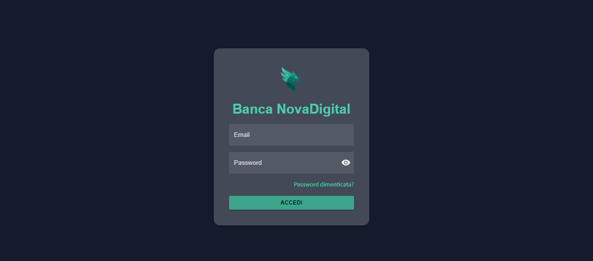
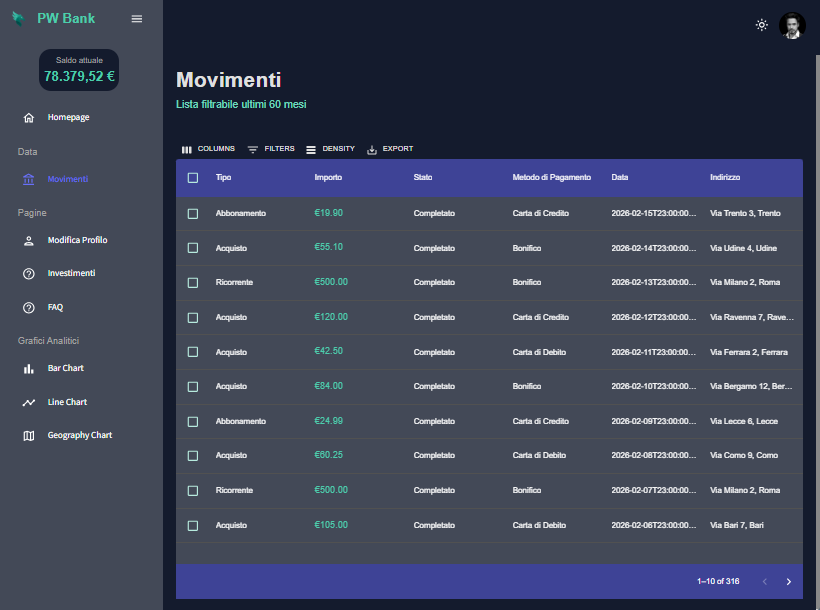
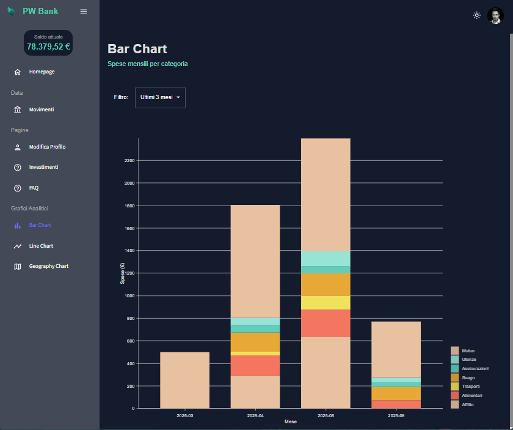
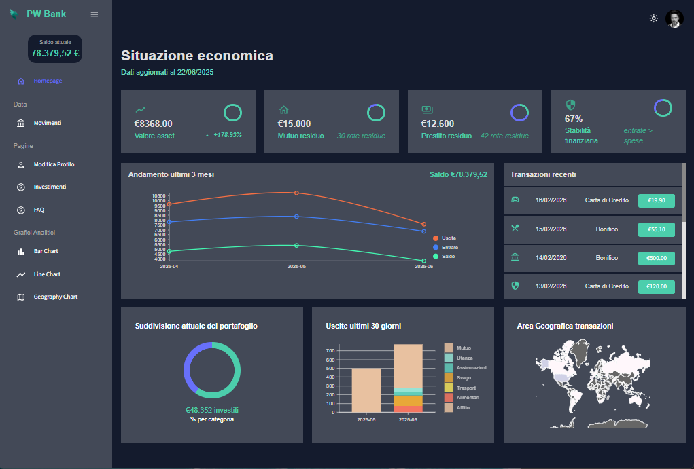
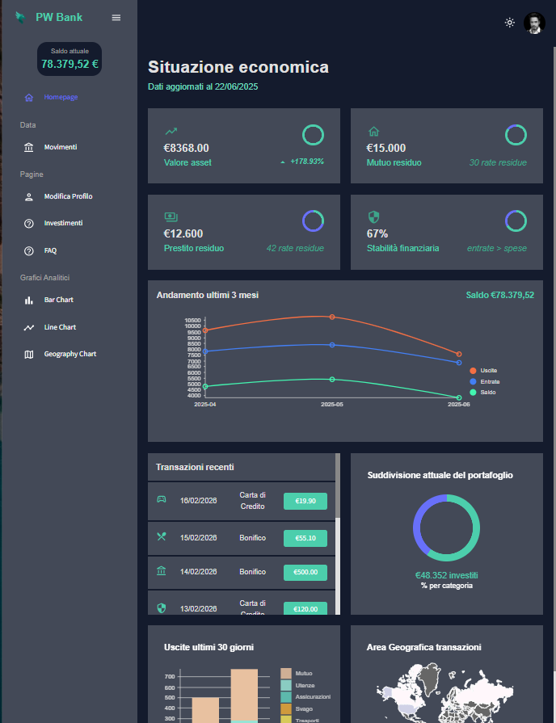

# 💼 PW Bank – Project Work Universitario

Questo progetto rappresenta il lavoro di fine corso per la laurea triennale in Informatica per le Aziende Digitali (L-31). Si tratta di un'applicazione web full-stack per la gestione finanziaria personale, progettata secondo principi moderni di ingegneria del software, sicurezza, modularità e ottimizzazione del dato.

## 🧩 Architettura del progetto

L’applicativo è strutturato in due macro-componenti principali:

- **Frontend**: realizzato in React, responsabile dell’interfaccia utente e della logica client-side.
- **Backend**: costruito con Express.js, espone le API REST e gestisce l’accesso al database MySQL.

La comunicazione tra le due parti avviene tramite chiamate HTTP protette da autenticazione JWT.

## 🗂️ Struttura delle cartelle

```
├── backend/                # Server Node.js con Express
│   ├── controllers/        # Logica delle API
│   ├── middleware/         # Middleware (gestione autenticazione, errori)
│   ├── routes/             # Routing API REST
│   ├── config/             # Connessione DB e middleware
│   ├── utils/              # Funzioni di supporto (es. aggiornamento rate)
│   └── README.md           # Documentazione backend
│
├── frontend/               # Applicazione React
│   ├── public/             # Assets pubblici (es. screenshot app)
│   ├── src/
│   │   ├── api/            # Client HTTP axios
│   │   ├── assets/         # Logo, avatar utente, immagini varie
│   │   ├── components/     # Componenti riutilizzabili
│   │   ├── scenes/         # Pagine principali
│   │   ├── redux/          # Slice Redux centralizzate
│   │   └── theme/          # Gestione dark/light mode
│   └── README.md           # Documentazione frontend
│
├── docs/                   # Documentazione API (Redocly)
├── .env                    # Variabili d’ambiente
├── README.md               # Documentazione generale del progetto
```

## ⚙️ Tecnologie e librerie principali

### 🖥️ Frontend (React + MUI)

- **React 18** – libreria SPA per la UI
- **Material UI (MUI)** – componenti e tema dark/light personalizzato
- **Redux Toolkit** – store centralizzato, slice modulari
- **Redux Persist** – persistenza automatica del token JWT
- **React Router DOM** – routing client-side
- **Axios** – comunicazione con il backend
- **Nivo** – grafici interattivi (line chart)
- **FullCalendar** – gestione eventi (rate mutuo/prestito)
- **Formik + Yup** – gestione e validazione dei form
- **Recharts / MUI DataGrid** – visualizzazione tabellare e interattiva

### 🧠 Backend (Node.js + Express)

- **Express.js** – framework leggero per API REST
- **MySQL** – database relazionale per dati persistenti
- **JWT (jsonwebtoken)** – autenticazione sicura tramite token
- **dotenv** – gestione configurazione ambienti
- **bcryptjs** – hashing delle password
- **axios** – chiamate verso API esterne (CoinGecko, CryptoPanic)
- **cors / helmet** – sicurezza e accessi controllati

### 🌍 API esterne

- **CoinGecko API** – prezzi asset digitali e storico andamento
- **CryptoPanic API** – notizie aggiornate sul mondo crypto

## 🔐 Sicurezza

- Login protetto da JWT, con refresh persistente via Redux
- Middleware Express per proteggere le rotte (`verifyToken`)
- Salvataggio password con hash (bcrypt)
- CORS e headers impostati per accesso controllato

## 📊 Database

- **Schema relazionale** progettato in DBML
- Tabelle: `utenti`, `transazioni`, `rate_mutuo`, `rate_prestito`, `investimenti`
- Aggiornamento automatico delle rate gestito al boot del backend
- Documentazione disponibile su [dbdiagram.io]([https://dbdiagram.io/](https://dbdiagram.io/d/6857fa93f039ec6d365250f3)

## 📄 Documentazione API

- ✅ Disponibile in formato Swagger (`/api-docs`)
- ✅ Versione Redoc online su GitHub Pages

## 🧪 Test & Dev

- Modalità development con `.env`
- Log semplificati per debugging (`console.warn`, `console.error`)
- Gestione centralizzata degli errori per tutte le API

## 📊 Screenshot dell'applicativo live

<em>Figura 1 – Form di accesso protetto con validazione lato client e tema scuro attivo.</em>


<em>Figura 2 – Elenco completo dei movimenti filtrabili: importo, categoria, data e indirizzo.</em>


<em>Figura 3 – Grafico a barre mensili: suddivisione delle spese per categoria negli ultimi tre mesi.</em>


<em>Figura 4 – Versione desktop della dashboard con grafici, saldo e riepilogo completo degli indicatori.</em>


<em>Figura 5 – Adattamento responsive su schermi medi: layout ottimizzato e leggibilità mantenuta.</em>


## 👤 Autore

Lorenzo Sijinardi  
Corso di Laurea L-31 – Informatica per le Aziende Digitali  
Università Telematica Pegaso  
Anno Accademico 2025/2026

---

## ⚖️ Licenza e diritti

Questo progetto è destinato esclusivamente a fini didattici e accademici, in conformità con le norme del Corso di Laurea.  
Tutti i contenuti originali (codice, schema DB, documentazione) sono protetti da diritto d'autore e non possono essere copiati, distribuiti o riutilizzati senza autorizzazione esplicita.

© 2025 – Lorenzo Sijinardi. Tutti i diritti riservati.
